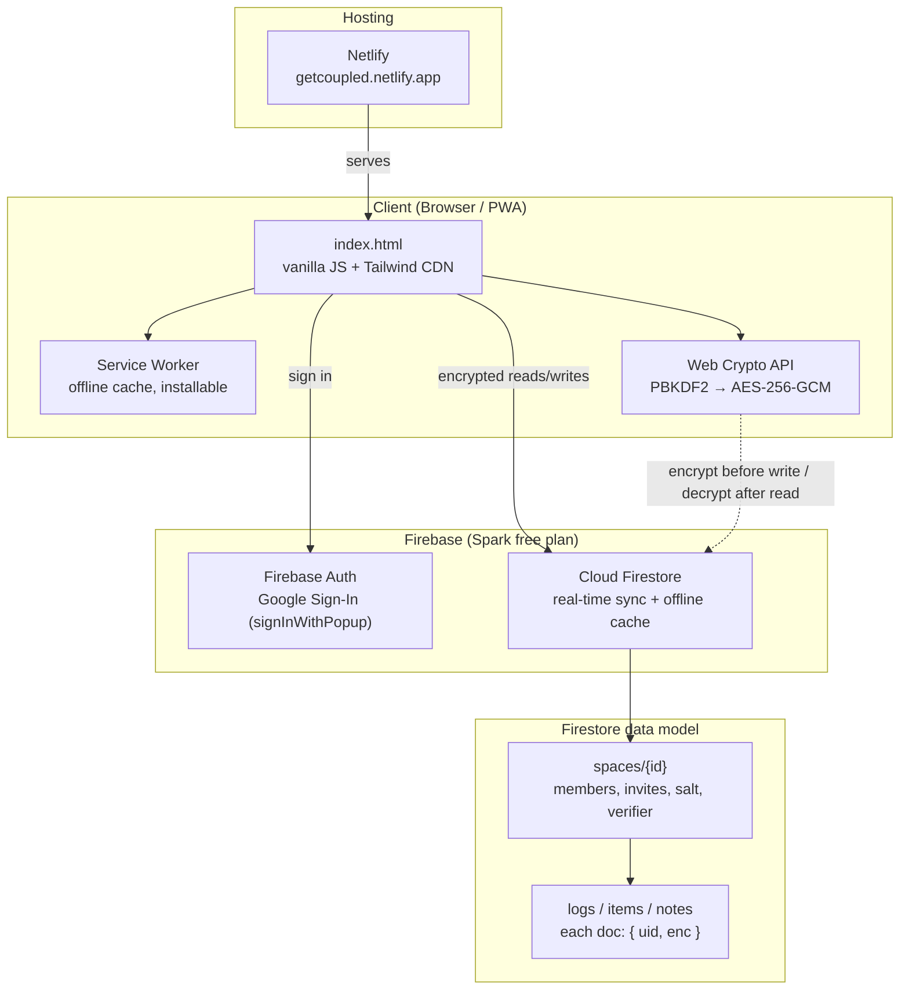

# Coupled 💞

A private, offline-first Progressive Web App for two partners — habit tracking, shared shopping & to-do lists, personal finance tracking, a "Friday Vault" of sealed love notes, and weekly insights. Sign in with Google, sync in real time, and everything is **end-to-end encrypted**.

> Single HTML file. No backend server. Free to run.

## Features
- ✅ **Habits** — tap to log; per-person weekly insights (side by side)
- 🛒 **Nest lists** — Shopping loads by default; add custom shared lists for movies, books, food ideas, and more
- 🪴 **Plants** — photo-based AI suggestions for plant name, description, and watering cadence
- 💶 **Money** — encrypted finance dashboard with Revolut CSV upload, manual entries, deduplication, budget progress, charts, AI insight, and a daily mindful-spending nudge
- 📎 **Documents** — encrypted document vault with automatic previews and local offline cache after first load
- 💌 **Partner nudges** — warm encrypted in-app nudges when your partner logs shared activity
- 🔒 **Friday Vault** — sealed notes that unlock every Friday 5pm, then live on as a shared history
- 👫 **Spaces & invites** — sign in with Google, invite your partner by email; you both share one private space
- 🔐 **End-to-end encryption** — content is encrypted in the browser (AES-GCM, key from a shared secret phrase); the database only ever stores ciphertext
- 📶 **Offline-first PWA** — install to your home screen; works offline and syncs when back online

## Tech
- **Frontend:** one file — `index.html` (vanilla JS + Tailwind via CDN)
- **Backend:** Firebase — Google Authentication + Cloud Firestore (real-time + offline cache), free Spark plan
- **Crypto:** Web Crypto API — PBKDF2 → AES-256-GCM
- **Hosting:** [Netlify](https://getcoupled.netlify.app/), auto-deployed from this repo's `main` branch

## Architecture

The client is a single static `index.html` served from Netlify — there is no application server. It talks directly to Firebase: Google Sign-In for auth, and Firestore for real-time, offline-capable data sync. Everything that isn't account/membership metadata is encrypted client-side before it ever reaches Firestore, so the database only ever holds ciphertext.

## Repository layout
| File | Purpose |
|------|---------|
| `index.html` | The entire app |
| `manifest.json` | PWA metadata (Add to Home Screen) |
| `firestore.rules` | Security rules — paste into Firebase Console → Firestore → Rules |
| `FIREBASE_SETUP.md` | Step-by-step first-time setup |

## Setup
See **[FIREBASE_SETUP.md](FIREBASE_SETUP.md)**. In short: create a Firebase project, enable Google sign-in, create Firestore + paste the rules, drop your `firebaseConfig` into `index.html`, and deploy.

## How the data model works
Each couple has one `spaces/{id}` document (members, invites, encryption salt + verifier). App data lives in sub-collections such as `logs`, `items`, `notes`, `financeTx`, and `files` — every content document stores only `{ uid, enc }`, where `enc` is the AES-GCM ciphertext of the real content. Security rules restrict every space and its sub-collections to its members.

## Privacy
The content of your habits, lists, and notes is end-to-end encrypted and unreadable without the shared secret phrase — not even the database host can read it. Account emails and space membership remain in clear text because they're required for login and invites. If both partners lose the secret phrase, the data cannot be recovered (by design).

## License
Personal project — use freely.
